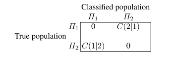
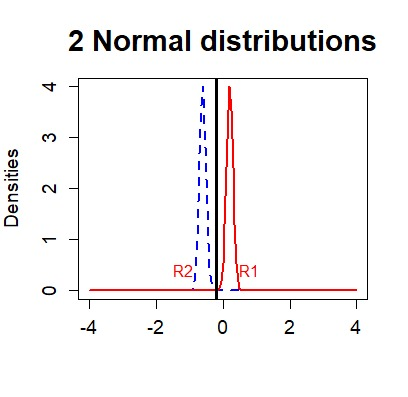

::: {style="background-color: #f0f0f0; border: 1px solid #000; padding: 10px;"}
<h5 style="text-align: left;">

<b>Kelompok 4</b>

</h5>

<ul>

<li>Nabhan Nabilah (4112321013)</li>

<li>Tangkas Pangestu (4112321021)</li>

<li>Indah Fitri Auliya (4112321031)</li>

</ul>
:::

<br>

<h1 style="text-align: center;">

<b>BAB 14</b>

</h1>

<h1 style="text-align: center;">

<b>ANALISIS DISKRIMINAN</b>

</h1>

<br>

<p style="text-align: justify;">
Analisis diskriminan digunakan dalam situasi di mana cluster diketahui secara apriori. Tujuan analisis diskriminan adalah untuk mengklasifikasikan suatu observasi, atau beberapa observasi, ke dalam kelompok-kelompok yang diketahui tersebut. Misalnya, dalam credit scoring, bank mengetahui dari pengalaman masa lalu bahwa ada nasabah yang baik (yang membayar kembali pinjamannya tanpa masalah) dan nasabah yang buruk (yang menunjukkan kesulitan dalam membayar kembali pinjamannya). Ketika nasabah baru meminta pinjaman, bank harus memutuskan apakah akan memberikan pinjaman atau tidak.. Catatan masa lalu bank menyediakan dua kumpulan data: pengamatan multivariat $xi$ pada dua kategori nasabah (termasuk, misalnya, usia, gaji, status perkawinan, jumlah pinjaman, dll.). Pelanggan baru adalah observasi baru $x$ dengan variabel yang sama. Aturan diskriminasi harus mengklasifikasikan pelanggan ke dalam salah satu dari dua kelompok yang ada dan analisis diskriminan harus mengevaluasi risiko kemungkinan "keputusan buruk".
</p>

<p style="text-align: justify;">
Banyak contoh lain yang dijelaskan di bawah ini, dan di sebagian besar penerapan, kelompok tersebut sesuai dengan klasifikasi alami atau kelompok yang diketahui dari sejarah (seperti dalam contoh penilaian kredit). Kelompok-kelompok ini bisa saja dibentuk melalui analisis klaster yang dilakukan pada data masa lalu.
</p>

<p style="text-align: justify;">
Bagian 14.1 menyajikan aturan alokasi ketika populasi diketahui, yaitu ketika kita mengetahui sebaran setiap populasi. Seperti yang dijelaskan dalam Sekte. 14.2, dalam praktiknya, karakteristik populasi harus diperkirakan berdasarkan sejarah. Metodenya diilustrasikan dalam beberapa contoh.
</p>

<br>

## 14.1 Aturan Alokasi untuk Distribusi yang Diketahui

<p style="text-align: justify;">
Analisis diskriminan adalah seperangkat metode dan alat yang digunakan untuk membedakan kelompok populasi $\prod _{j}$ dan untuk menentukan bagaimana mengalokasikan observasi baru ke dalam kelompok. Dalam salah satu contoh yang kita jalankan, kita tertarik untuk membedakannya uang kertas palsu dan asli berdasarkan pengukuran uang kertas tersebut, lihat sekte.B.2. Dalam hal ini, kita memiliki dua kelompok (uang kertas palsu dan asli) dan kita ingin membuat algoritma (aturan) yang dapat mengalokasikan observasi baru (selembar uang kertas baru) ke dalam salah satu kelompok.
</p>

<p style="text-align: justify;">
Contoh lainnya adalah pendeteksian konsumen baru yang "cepat" dan "lambat" produk yang diperkenalkan. Dengan menggunakan karakteristik konsumen seperti pendidikan, pendapatan, ukuran keluarga, dan jumlah perpindahan merek sebelumnya, kita ingin mengklasifikasikan setiap konsumen menjadi dua kelompok yang baru saja diidentifikasi.
</p>

<p style="text-align: justify;">
Dalam puisi dan studi sastra, frekuensi kata-kata yang diucapkan atau ditulis dan panjang kalimat menunjukkan profil seniman dan penulis yang berbeda.Itu bisa berupa minat untuk mengatribusikan karya sastra atau seni yang tidak diketahui kepada penulis tertentu dengan tujuan tertentu profil. Langkah-langkah antropologis pada patung-patung kuno membantu dalam membedakannya tubuh laki-laki dan perempuan.Peringkat risiko kredit yang baik dan buruk merupakan suatu diskriminasi permasalahan yang mungkin dapat diatasi dengan menggunakan pengamatan terhadap pendapatan, umum, jumlah kredit kartu, ukuran keluarga, dll.
</p>

<br>

<p style="text-align: justify;">
Secara umum, kita mempunyai populasi $\prod _{j}j=1,2,...,J$ dan kita harus mengalokasikan pengamatan $x$ ke salah satu kelompok ini. Aturan yang *diskriminatif* adalah pemisahan ruang sampel (umumnya $\mathbb{R}^{p}$) kedalam himpunan $R_{j}$ sehingga jika $x\epsilon R_{j}$, maka didefinisikan sebagai anggota populasi $\prod _{j}$.
</p>

<p style="text-align: justify;">
Tugas utama analisis diskriminan adalah menemukan daerah $R_{j}$ yang "baik" sehingga kesalahan-kesalahan klasifikasi kecil. Berikut ini kita uraikan aturan-atturan tersebut ketika sebaran penduduk diketahui.
</p>

<br>

### *Aturan Diskriminasi Kemungkinan Maksimum (Maximum Likelihood)*

<p style="text-align: justify;">
Nyatakan kepadatan setiap popuulasi $\prod _{j}$ dengan $f_{j}(x)$. *Aturan diskriminasi kemungkinan maksimum* (aturan ML) diberikan dengan mengalokasikan $x$ ke $\prod _{j}$ untuk memaksimalkan kemungkinan $L_{j}(x)=f_{j}(x)$ arg $max_{i}f_{i}(x)$.
</p>

<p style="text-align: justify;">
Jika beberapa $f_{i}$ memberikan nilai maksimum yang sama maka salah satu dari $f_{i}$ tersebut dapat dipilih. Matematika secara otomatis, himpunan $R_{j}$ yang diberikan oleh aturan diskriminasi ML didefinisikan sebagai
</p>

$$R_{j}=\left\{x:L_{j}(x) >L_{i}(x) untuk  i=1,...,J,i\neq j\right\}$$

<p style="text-align: justify;">
Dengan mengklasifikasikan observasi ke dalam kelompok tertentu kita mungkin menemui kesalahan klasifikasi. Untuk $J=2$ kelompok peluang memasukkan $x$ ke ddalam kelompok 2 meskipun itu dari populasi 1 dapat dihitung sebagai
</p>

$$p_{21}=P(X \epsilon R_{2}|\prod _{1})=\int_{R_{1}}f_{1}(x)dx.$$

<p style="text-align: justify;">
Demikian pula probabilitas bersyarat untuk mengklasifikasikan suatu objek sebagai milik yang pertama populasi $\prod _{1}$ meskipun sebenarnya berasal dari $\prod _{2}$ tersebut $$p_{12}=P(X \epsilon R_{1}|\prod _{2})=\int_{R_{1}}f_{2}(x)dx.$$
</p>

<p style="text-align: justify;">
Pengamatan yang salah klasifikasi menimbulkan biaya $C(i|j)$ kettika pengamatan $\prod _{j}$ ditugaskan ke $R_{i}$. Dalam contoh risiko kredit, ini mungkin merupakan biaya kredit yang "masam". Struktur biaya dapat digambarkan dalam matriks biaya
</p>



<p style="text-align: justify;">
Misalnya $\pi _{j}$ adalah probabilitas prior dari populasi $\prod _{j}$, dengan "prior" berarti probabilitas *sebuah priori* bahwa individu yang dipilih secara acak adalah anggota $\prod _{j}$ (yaitu, sebelum melihat nilai $x$). Probabilitas sebelumnya harus dipertimbangkan jika sudah jelas sebelumnya bahwa suatu observasi kemungkinan besar berasal dari populasi tertentu $\prod _{j}$. Contohnya adalah klasifikasi nada musik. Jika diketahui bahwa dalam jangka waktu tertentu sebagian besar lagu diciptakan oleh komposer tertentu, maka kemungkinan besar lagu tertentu diciptakan oleh komposer tersebut. Oleh karena itu, ia harus menerima probabilitas prioritas yang lebih tinggi ketika lagu ditugaskan ke grup tertentu.
</p>

<br>

*Perkiraan biaya kesalahan klasifikasi* (*ECM*) diberikan oleh

$$ECM=C(2|1)p_{21}\pi _{1}+C(1|2)p_{12}\pi _{2}$$

<p style="text-align: justify;">
Kita akan tertarik pada aturan klasifikasi yang menjaga *ECM* tetap kecil atau meminimalkannya pada suatu kelas aturan. Aturan diskriminan yang meminimalkan *ECM* (14.4) untuk dua populasi diberikan di bawah ini.
</p>

**Teorema 14.1** *Untuk dua populasi tertentu, aturan minimalisasi ECM diberikan oleh*

$$R_{1}=\left\{ x:\frac{x:f_{1}(x)}{f_{2}(x)}\geqslant \left ( \frac{C(1|2)}{C(2|1)}\right )\left ( \frac{\pi _{2}}{\pi _{1}} \right )\right\}$$ $$R_{2}=\left\{ x:\frac{x:f_{1}(x)}{f_{2}(x)}< \left ( \frac{C(1|2)}{C(2|1)} \right )\left ( \frac{\pi _{2}}{\pi _{1}} \right )\right\}$$

<p style="text-align: justify;">
Oleh karena itu, aturan diskriminan ML merupakan kasus khusus dari aturan ECM untuk biaya kesalahan klasifikasi yang sama dan probabilitas sebelumnya yang sama. Untuk menyederhanakan kasus biaya kesatuan, $C(1|2)=C(2|1)=1$, dan probabilitas prior yang sama, $\pi _{2}=\pi _{1}$, diasumsikan sebagai berikut.
</p>

Teorema 14.1 akan dibuktikan dengan contoh credit scoring.

<p style="text-align: justify;">
*Contoh 14.1* Misalkan $\prod _{1}$ mewakili populasi klien buruk yang menimbulkan biaya $C(1|2)$ jika mereka diklasifikasikan sebagai klien baik. Secara analogi, definisikan $C(2|1)$ sebagai biaya kehilangan klien baik yang diklasifikasikan sebagai klien buruk. Misalkan ÿ menunjukkan keuntungan bank untuk klasifikasi yang benar dari klien yang baik.Maka total keuntungan bank adalah $$G(R_{2})= -C(2|1)\pi _{1}\int I(x\epsilon R_{2})f_{1}(x)dx-C(1|2)\pi _{2}\int \left\{ 1-I(X\epsilon R_{2})\right\}f_{2}(x)dx+\gamma \pi _{2}\int I(x\epsilon R_{2})f_{2}(x)dx$$ $$=-C(1|2)\pi _{2} +\int I(x\epsilon R_{2})\left\{ -C(2|1)\pi _{1}f_{1}(x)+(C(1|2)+\gamma )\pi _{2}f_{2}(x)\right\}dx$$
</p>

Karena suku pertama persamaan ini konstan, maka nilai maksimum jelas diperoleh

$$R_{2}=\left\{ x:-C(2|1)\pi _{1}f_{1}(x)+\left\{ C(1|2)+\gamma \right\}\pi _{2}f_{2}(x)\geq 0\right\}.$$

Ini setara dengan

$$R_{2}=\left\{ x:\frac{f_{2}(x)}{f_{1}(x)}\geq \frac{C(2|1)\pi _{1}}{\left\{C(1|2) +\gamma \right\}\pi _{2}}\right\}$$

yang sesuai dengan himpunan $R_{2}$ dalam Teorema 14.1 untuk penguatan $\gamma =0.$

*Contoh 14.2* Misalkan $x\epsilon \left\{ 0,1\right\}$ dan

$$\prod _{1}:P(X=0)=P(X=1)=\frac{1}{2}$$ $$\prod _{2}:P(X=0)=\frac{1}{4}=1-P(X=1).$$

Ruang sampelnya adalah himpunan $\left\{0,1 \right\}$. Aturan diskriminan ML adalah mengalokasikan $x=0$ ke $\prod _{1}$ dan $x=1$ ke $\prod _{2}$, dengan mendefinisikan himpunan $R_{1}=\left\{ 0\right\},R_{2}=\left\{ 1\right\}$ dan $R_{1}\bigcup R_{2}=\left\{ 0,1\right\}.$

*Contoh 14.3* Perhatikan dua populasi normal

$$\prod _{1}:N(\mu _{1},\sigma _{1}^{2}),$$ $$\prod _{2}:N(\mu _{2},\sigma _{2}^{2}).$$

Kemudian

$$L_{i}(x)=(2\sigma _{i}^{2})^{-1/2}exp\left\{ -\frac{1}{2}\left ( \frac{x-\mu _{i}}{\sigma _{i}} \right )^{2}\right\}.$$

Oleh karena itu $x$ dialokasikan ke $\prod _{1}(x\epsilon R_{1})$ jika $L_{1}(x)\geq L_{2}(x)$. Perhatikan bahwa $L_{1}(x)\geq L_{2}(x)$ equivalen dengan

$$\frac{\sigma _{2}}{\sigma _{1}}exp\left [ -\frac{1}{2} \left\{ \left ( \frac{x-\mu _{1}}{\sigma _{1}}\right )^{2}-\left ( \frac{x-\mu _{2}}{\sigma _{2}} \right )^{2}\right\}\right ]\geq 1$$ atau $$x^{2}\left ( \frac{1}{\sigma _{1}^{2}}-\frac{1}{\sigma _{2}^{2}} \right )-2x\left ( \frac{\mu _{1}}{\sigma _{1}^{2}} -\frac{\mu _{2}}{\sigma _{2}^{2}}\right )+\left ( \frac{\mu _{1}^{2}}{\sigma _{1}^{2}} -\frac{\mu _{2}^{2}}{\sigma _{2}^{2}}\right )\leq 2log\frac{\sigma _{2}}{\sigma _{1}}.$$

Gambar 14.1 Maksimum aturan kemungkinan untuk normal distribusi MVAdisnorm

```{r}
# clear all variables
rm(list = ls(all = TRUE))
graphics.off()

x 	= seq(-4, 4, 0.05)  	# generates a sequence on real axis
s1 	= 0.1  			# standard deviation for y1
mu1 	= 0.2  			# mean for y1
s2 	= 0.1  			# square root of variance for y2
mu2 	= -0.6  		# mean for y2

y1 = cbind(x, dnorm(x, mean = mu1, sd = s1))  # density y1
y2 = cbind(x, dnorm(x, mean = mu2, sd = s2))  # density y2

if (mu1 != mu2 & s1 != s2) {
  
  # first discrimination point
  c1 = -(mu2 * s1^2 - mu1 * s2^2)/(s2^2 - s1^2) + sqrt(((mu2 * s1^2 - mu1 * s2^2)/(s2^2 - 
                                                                                     s1^2))^2 - ((mu1^2 * s2^2 - mu2^2 * s1^2 - 2 * log(s2/s1) * s1^2 * s2^2)/(s2^2 - 
                                                                                                                                                                 s1^2)))
  
  # second discrimination point
  c2 = -(mu2 * s1^2 - mu1 * s2^2)/(s2^2 - s1^2) - sqrt(((mu2 * s1^2 - mu1 * s2^2)/(s2^2 - 
                                                                                     s1^2))^2 - ((mu1^2 * s2^2 - mu2^2 * s1^2 - 2 * log(s2/s1) * s1^2 * s2^2)/(s2^2 - 
                                                                                                                                                                 s1^2)))
} else if (mu1 != mu2 & s1 == s2) {
  if (mu2 < 0 & mu1 < 0) {
    c1 = mu2 - (mu2 - mu1)/2
    c2 = c1
  } else if (mu2 < 0 & mu1 >= 0) {
    c1 = mu2 - (mu2 - mu1)/2
    c2 = c1
  } else if (mu2 == 0 & mu1 < 0) {
    c1 = -abs(mu2 - mu1)/2
    c2 = c1
  } else if (mu2 > 0 & mu1 < 0) {
    c1 = mu2 - abs(mu2 - mu1)/2
    c2 = c1
  } else if (mu2 >= 0 & mu1 >= 0) {
    c1 = abs(mu2 - mu1)/2
    c2 = c1
  }
} else if (mu1 == mu2 & s1 == s2) {
  c1 = Inf
  c2 = -Inf
} else if (mu1 == mu2 & s1 != s2) {
  
  # first discrimination point
  c1 = -(mu2 * s1^2 - mu1 * s2^2)/(s2^2 - s1^2) + sqrt(((mu2 * s1^2 - mu1 * s2^2)/(s2^2 - 
                                                                                     s1^2))^2 - ((mu1^2 * s2^2 - mu2^2 * s1^2 - 2 * log(s2/s1) * s1^2 * s2^2)/(s2^2 - 
                                                                                                                                                                 s1^2)))
  
  # second discrimination point
  c2 = -(mu2 * s1^2 - mu1 * s2^2)/(s2^2 - s1^2) - sqrt(((mu2 * s1^2 - mu1 * s2^2)/(s2^2 - 
                                                                                     s1^2))^2 - ((mu1^2 * s2^2 - mu2^2 * s1^2 - 2 * log(s2/s1) * s1^2 * s2^2)/(s2^2 - 
                                                                                                                                                                 s1^2)))
}

limy = c(0, max(y1[, 2], y2[, 2]))
if (limy[2] < 0.4) {
  limy = c(0, 0.41)
}

# Plot
plot(y2, type = "l", lwd = 2, lty = 2, col = "blue", xlab = "", ylab = "Densities", 
     cex.lab = 1.2, cex.axis = 1.2, ylim = limy)
lines(y1, type = "l", lwd = 2, col = "red")
abline(v = c1, lwd = 3)
abline(v = c2, lwd = 3)

if (c1 == c2 & s1 == s2) {
  if (mu2 < 0) {
    text(c1 - 1, 0.4, "R2", col = "red")
    text(c1 + 1, 0.4, "R1", col = "red")
  } else {
    text(c1 - 1, 0.4, "R1", col = "red")
    text(c1 + 1, 0.4, "R2", col = "red")
  }
} else if (c1 != c2 & s2 > s1) {
  if (mu1 > mu2) {
    if (s1 >= 1) {
      text(c1 - 1, 0.4, "R2", col = "red")
      text(c1 + 0.8, 0.4, "R1", col = "red")
      text(c2 - 0.8, 0.4, "R1", col = "red")
    } else if (s1 >= 0 & s1 < 0.5) {
      text(c1 - s1 - 0.15, 0.4, "R2", col = "red")
      text(c1 + 0.5, 0.4, "R1", col = "red")
      text(c2 - 0.4, 0.4, "R1", col = "red")
    } else if (s1 >= 0.5 & s1 < 1) {
      text(c1 - 1, 0.4, "R2", col = "red")
      text(c1 + 0.5, 0.4, "R1", col = "red")
      text(c2 - 0.4, 0.4, "R1", col = "red")
    }
    
    # text(c1-1,0.4,'R1',col='red') text(c1+1,0.4,'R2',col='red')
    # text(c2-0.4,0.4,'R2',col='red')
  } else if (mu1 < mu2) {
    text(c1 - 1, 0.4, "R1", col = "red")
    text(c1 + 1, 0.4, "R2", col = "red")
    text(c2 - 0.4, 0.4, "R2", col = "red")
  } else if (mu1 == mu2) {
    text(c1 - s1 - 0.1, 0.4, "R1", col = "red")
    text(c1 + 1, 0.4, "R2", col = "red")
    text(c2 - 0.4, 0.4, "R2", col = "red")
  }
} else if (c1 != c2 & s2 < s1) {
  if (mu1 > mu2) {
    text(c1 - 1, 0.4, "R2", col = "red")
    text(c1 + 1, 0.4, "R1", col = "red")
    text(c2 - 0.6, 0.4, "R1", col = "red")
  } else if (mu1 < mu2) {
    if (s2 >= 1) {
      text(c1 - 1, 0.4, "R2", col = "red")
      text(c1 + 0.8, 0.4, "R1", col = "red")
      text(c2 - 0.8, 0.4, "R1", col = "red")
    } else if (s2 >= 0 & s2 < 0.5) {
      text(c1 - s2 - 0.15, 0.4, "R2", col = "red")
      text(c1 + 0.5, 0.4, "R1", col = "red")
      text(c2 - 0.4, 0.4, "R1", col = "red")
    } else if (s2 >= 0.5 & s2 < 1) {
      text(c1 - 1, 0.4, "R2", col = "red")
      text(c1 + 0.5, 0.4, "R1", col = "red")
      text(c2 - 0.4, 0.4, "R1", col = "red")
    }
  } else if (mu1 == mu2) {
    text(c1 - 1, 0.4, "R2", col = "red")
    text(c1 + 1, 0.4, "R1", col = "red")
    text(c2 - 0.4, 0.4, "R1", col = "red")
  }
} else if (c1 != c2 & mu1 == mu2) {
  text(c1 - 1, 0.4, "R1", col = "red")
  text(c1 + 1, 0.4, "R2", col = "red")
  text(c2 - 0.4, 0.4, "R2", col = "red")
}

title("2 Normal distributions", cex.main = 1.8) 

```



Misalkan $\mu _{1}=0,\sigma _{1}=1$ dan $\mu _{2}=1,\sigma _{2}=\frac{1}{2}$. Rumus (14.5) mengarah ke

$$R_{1}=\left\{ x:x\leq \frac{1}{3}\left ( 4-\sqrt{4+6log(2)} \right ) atau x\geq \frac{1}{3}\left ( 4+\sqrt{4+6log(2)} \right )\right\},$$ $$R_{2}=\mathbb{R}\setminus R_{1}.$$

Situasi ini ditunjukkan pada Gambar 14.1.

Situasinya disederhanakan dalam kasus varians yang sama $\sigma _{1}=\sigma _{2}.$ Yang diskriminan aturan (14.5) maka $(untuk \mu _{1}<\mu _{2})$

$$x \to \prod _{1}, jika x\epsilon R_{1}=\left\{ x:x\leq \frac{1}{2}(\mu _{1}+\mu _{2})\right\},$$ $$x\to \prod _{2}, jika x\epsilon R_{2}=\left\{ x:x>\frac{1}{2}(\mu _{1}+\mu _{2})\right\}.$$

<p style="text-align: justify;">
Teorema14.2 menunjukkan bahwa aturan diskriminan ML untuk observasi multinormal adalah berhubungan erat dengan jarak Mahalanobis. Aturan diskriminatif didasarkan pada kombinasi linier dan termasuk dalam keluarga analisis diskriminan linier (LDA) metode.
</p>

**Teorema 14.2** *Misalkan* $\prod _{i}=N_{p}(\mu _{i},\sum ).$

(a) *Aturan ML mengalokasikan* $x$ *ke* $\prod _{j}$, *dimana* $j\epsilon \left\{ 1,...,J\right\}$ *adalah nilai yang meminimalkan jarak Mahalanobis persegi anatara* $x$ *dan* $\mu _{i}$:

$$\delta ^{2}(x, \mu _{i})=(x-\mu _{i})^{\top }\sum ^{-1}(x-\mu _{i}), i=1,...,J.$$

(b) *Dalam kasus* $J=2$,

$$x\in R_{1}\Leftrightarrow \alpha ^{\top }(X-\mu )\geq 0,$$

*dimana* $\alpha =\sum ^{-1}(\mu _{1}-\mu _{2})$ dan $\mu =\frac{1}{2}(\mu _{1}+\mu _{2}).$

*Bukti*. Bagian (a) dari teorema ini mengikuti langsung perbandingan kemungkinan.

Untuk $J=2,$ bagian (a) menyatakan bahwa $x$ dialokasikan ke $\prod _{1}$ jika

$$(x-\mu _{1})^{\top }\sum ^{-1}(x-\mu _{1})\leq (x-\mu _{2})^{\top }\sum ^{-1}(x-\mu _{2})$$

Penataan ulang istilah mengarah ke

$$-2\mu_{1}^{\top }\sum ^{-1}x+2\mu _{2}^{\top }\sum ^{-1}x+\mu _{1}^{\top }\sum ^{-1}\mu _{1}-\mu _{2}^{\top }\sum ^{-1}\mu _{2}\leq 0,$$

equivalen dengan

$$2(\mu _{2}-\mu _{1})^{\top }\sum ^{-1}x+(\mu _{1}-\mu _{2})^{\top }\sum ^{-1}(\mu _{1}+\mu _{2})\leq 0,$$ $$(\mu _{1}-\mu _{2})^{\top }\sum ^{-1}\left\{ x-\frac{1}{2}(\mu _{1}+\mu _{2})\right\}\geq 0,$$ $$\alpha ^{\top }(x-\mu )\geq 0.$$

<br>

### *Aturan Diskriminan Bayes*

<p style="text-align: justify;">
Kita telah melihat contoh dimana pengetahuan sebelumnya tentang probabilitas klasifikasi ke dalam $\prod _{j}$ diasumsikan.Nyatakan probabilitas sebelumnya dengan $\pi _{j}$ dan perhatikan bahwa $\sum _{j}^{J}=\pi _{j}=1.$ Aturan diskriminasi Bayes mengalokasikan $x$ ke $\prod _{j}$ yang memberikan nilai $\pi _{i}f_{i}(x), \pi _{j}f_{j}(x)= max_{i}\pi _{i}f_{i}(x).$
</p>

<p style="text-align: justify;">
Oleh karena itu, aturan diskriminan didefinisikan oleh $R_{j}=\left\{ x:\pi _{j}f_{j}(x)\geq \pi _{i}f_{i}(x) untuk i=1,...,J\right\}.$ Jelas sekali aturan Bayes identik dengan aturan diskriminan ML untuk $\pi _{j}=1/J.$
</p>

<p style="text-align: justify;">
Modifikasi selanjutnya adalah mengalokasikan $x$ ke $\prod _{j}$ dengan probabilitas tertentu $\phi _{j}(x),$ sehingga $\sum_{j}^{J}=1\phi _{j}(x)=1$ untuk semua $x$. Ini disebut *aturan diskriminan acak*. Aturan diskriminan acak adalah generalisasi dari aturan diskriminan deterministik sejak saat itu
</p>

<p style="text-align: justify;">
$$\phi _{j}(x)=\left\{\begin{matrix}
1 & jika \pi _{j}f_{j}(x)=max_{i}\pi _{i}f_{i}(x), \\
0 & lainnya \\
\end{matrix}\right.$$ mencerminkan aturan deterministik. Aturan diskriminan manakah yang baik? Kita akan memerlukan ukuran perbandingan. Menunjukkan
</p>

$$p_{ij}=\int \phi _{i}(x)f_{i}(x)dx$$

<p style="text-align: justify;">
sebagai probabilitas mengalokasikan $x$ ke $\prod _{i}$ jika $x$ tersebut memang termasuk dalam $\prod _{j}$. Aturan diskriminan dengan probabilitas $p_{ij}$ sama baiknya dengan aturan diskriminan lainnya dengan probabilitas $p'_{ij}$ jika
</p>

$$p_{ii}\geq p'_{ii} untuk semua i=1,...,J.$$

<p style="text-align: justify;">
Kita menyebut aturan pertama lebih baik jika pertidaksamaan tegas pada (14.8) berlaku untuk setidaknya satu $i$. Sebuah aturan diskriminan disebut *dapat diterima* jika tidak ada aturan diskriminan yang lebih baik.
</p>

**Teorema 14.3** *Semua aturan diskriminan Bayes (termasuk aturan ML) dapat diterima*.

<br>

### *Kemungkinan Kesalahan Klasifikasi untuk aturan ML (J=2)*

<p style="text-align: justify;">
Misalkan $\prod_{i}=N_{p}(\mu _{i},\sum ).$ Dalam kasus dua kelompok, tidak sulit untuk menurunkannya kemungkinan kesalahan klasifikasi untuk aturan diskriminan ML. Misalnya saja $p_{12}=P(x\in R_{1}|\prod _{2}).$ Berdasarkan bagian (b) dalam Teorema 14.2 kita punya
</p>

$$p_{12}=P\left\{ \alpha ^{\top }(x-\mu )>0|\prod ^{2}\right\}.$$

<p style="text-align: justify;">
Jika $X\in R_{2},\alpha ^{\top }(X-\mu )\sim N\left ( -\frac{1}{2}\delta ^{2},\delta ^{2} \right )$ dimana $\delta ^{2}=(\mu _{1}-\mu _{2})^{\top }\sum ^{-1}(\mu _{1}-\mu _{2})$ adalah kuadrat jarak Mahalanobis antara dua populasi, kita peroleh
</p>

$$p_{12}=\Phi \left ( -\frac{1}{2}\delta  \right ).$$

<p style="text-align: justify;">
Demikian pula peluang untuk diklasifikasikan ke dalam populasi $2$ meskipun $x$ berasal dari $\prod _{1}$ sama dengan $p_{21}=\Phi \left ( -\frac{1}{2}\delta \right ).$
</p>

<br>

### *Klasifikasi dengan Matriks Kovariansi Berbeda*

<p style="text-align: justify;">
*ECM* minimum bergantung pada rasio kepadatan $\frac{f_{1}(x)}{f_{2}(x)}$ atau setara di perbedaan $log\left\{ f_{1}(x)\right\}-log\left\{ f_{2}(x)\right\}$. Ketika kovarians untuk kedua fungsi kepadatan berbeda, aturan alokasi menjadi lebih rumit:
</p>

$$R_{1}=\left\{ x:-\frac{1}{2}x^{\top }(\sum_{1}^{-1}-\sum_{2}^{-1})x+(\mu _{1}^{\top }\sum_{1}^{-1}-\mu _{2}^{\top }\sum_{2}^{-1})x-k\geq log\left [ \left ( \frac{C(1|2)}{C(2|1)} \right )\left ( \frac{\pi _{2}}{\pi _{1}} \right ) \right ]\right\},$$ $$R_{1}=\left\{ x:-\frac{1}{2}x^{\top }(\sum_{1}^{-1}-\sum_{2}^{-1})x+(\mu _{1}^{\top }\sum_{1}^{-1}-\mu _{2}^{\top }\sum_{2}^{-1})x-k< log\left [ \left ( \frac{C(1|2)}{C(2|1)} \right )\left ( \frac{\pi _{2}}{\pi _{1}} \right ) \right ]\right\}$$

<p style="text-align: justify;">
dimana $k=\frac{1}{2}log\left ( \frac{|\sum _{1}|}{|\sum _{2}|} \right )+\frac{1}{2}\left ( \mu _{1}^{\top }\sum _{1}^{-1}\mu _{1}-\mu _{2}^{\top }\sum _{2}^{-1}\mu _{2} \right ).$ Wilayah klaasifikasinya adalah ditentukan oleh *fungsi kuadrat*. Oleh karena itu mereka termasuk dalam keluarga Quadratic Metode Analisis Diskriminan (QDA). *Aturan klasifikasi kuadrat* ini bertepatan dengan aturan yang digunakan ketika $\sum _{1}=\sum _{2}$ karena sejak $\frac{1}{2}x^{\top }(\sum _{1}^{-1}-\sum _{2}^{-1})x$ menghilang.
</p>

<br>

+------------------------------------------------------------------------------------------------------------------------------------------------------------------------------------------------------------------------------------------------------------------------------------------+---------+
| # Ringkasan                                                                                                                                                                                                                                                                              |         |
|                                                                                                                                                                                                                                                                                          |         |
| -   Analisis diskriminan adalah serangkaian metode yang digunakan untuk membedakan kelompok-kelompok dalam data dan mengalokasikan pengamatan baru ke dalam kelompok-kelompok yang sudah ada.                                                                                            |         |
+------------------------------------------------------------------------------------------------------------------------------------------------------------------------------------------------------------------------------------------------------------------------------------------+---------+
| -   Mengingat data berasal dari populasi $\prod _{j}$ dengan kepadatan $f_{f},j=1,...,J$ , aturan diskriminan kemungkinan maksimum (aturan ML) mengalokasikan observasi $x$ ke populasi $\prod _{j}$ yang memiliki kemungkinan maksimum $L_{j} (x)=f_{j}(x)=max_{i}f_{i}(x)$. \|         |         |
+------------------------------------------------------------------------------------------------------------------------------------------------------------------------------------------------------------------------------------------------------------------------------------------+---------+
| -   Mengingat probabilitas sebelumnya $\pi _{j}$ untuk populasi $\prod _{j}$, aturan diskriminan Bayes mengalokasikan observasi $x$ ke populasi $\prod _{j}$ yang memaksimalkan $\pi _{i} f_{i}(x)$ terhadap $i$. Semua aturan diskriminan Bayes (termasuk aturan ML) dapat diterima. \| |         |
+------------------------------------------------------------------------------------------------------------------------------------------------------------------------------------------------------------------------------------------------------------------------------------------+---------+
| -   Untuk aturan ML dan $J = 2$ populasi normal, probabilitas kesalahan klasifikasi diberikan oleh $p_{12}=p_{21}=\Phi \left ( -\frac{1}{2}\delta \right )$ dimana δ adalah jarak Mahalanobis antara dua populasi.                                                                       |         |
+------------------------------------------------------------------------------------------------------------------------------------------------------------------------------------------------------------------------------------------------------------------------------------------+---------+
| -   Klasifikasi dua populasi normal dengan matriks kovarians berbeda (aturan ML) menghasilkan wilayah yang ditentukan oleh fungsi kuadrat.                                                                                                                                               |         |
+------------------------------------------------------------------------------------------------------------------------------------------------------------------------------------------------------------------------------------------------------------------------------------------+---------+
| -   Aturan diskriminan yang diinginkan memiliki biaya kesalahan klasifikasi (*ECM*) yang rendah.                                                                                                                                                                                         |         |
+------------------------------------------------------------------------------------------------------------------------------------------------------------------------------------------------------------------------------------------------------------------------------------------+---------+

<br>

## 14.2 Aturan Diskriminasi dalam Praktik

<p style="text-align: justify;">
Aturan ML digunakan jika distribusi data diketahui hingga parameter. Misalkan sebagai contoh bahwa data berasal dari distribusi normal multivariat $Np(μj, Σ)$. Jika kita memiliki $J$ kelompok dengan $nj$ observasi dalam setiap kelompok, kita menggunakan $\bar{x}j$ untuk memperkirakan $μj$, dan $Sj$ untuk memperkirakan $Σ$. Kovariansi umum dapat diestimasi dengan</p>


$$
\begin{equation}
S_{u}=\sum_{j=1}^{J}nj\left (\frac{Sj}{n-j} \right )
\end{equation}
$$

dengan $n=\sum_{j=1}^{J}nj$. Jadi versi empiris aturan ML dari Teorema 14.2 adalah mengalokasikan observasi baru $x$ ke $\Pi{j}$ sedemikian rupa sehingga $j$ meminimalkan

$$
\begin{equation}
\left ( x-\bar{x} \right )^\top S_{u}^{-1}\left ( x-\bar{x} \right ) for\ i \in  \left \{ 1,...,J \right \}
\end{equation}
$$

*Contoh 14.4* Mari kita terapkan aturan ini pada uang kertas Swiss. Kami menggunakan 20 uang kertas bank yang dipilih secara acak yang telah kami kelompokkan menjadi 2 kelompok dalam Contoh 13.8. Pertama, kovarians $Σ$ diestimasi dengan rata-rata kovarians $\Pi{1}$ (kelompok 1) dan $\Pi{2}$ (kelompok 2). *Hyperplane* $\hat{\alpha}^{\top }\left ( x-\bar{x} \right )=0$ yang memisahkan kedua populasi diberikan oleh

$$
\begin{align}
\hat{\alpha}&=S_{u}^{-1}(\bar{x_{1}}-\bar{x_{2}})=\left ( -12.18,20.54,-19.22,-15.55,-13.06,21.43 \right )^{\top}\\
\bar{x}&=\frac{1}{2}(\bar{x_{1}}+\bar{x_{2}})=\left ( 214.79,130.05,129.92,9.23,10.48,140.46 \right )^{\top}
\end{align}
$$

Sekarang mari kita terapkan aturan diskriminasi pada seluruh kumpulan data uang kertas. Menghitung jumlah kesalahan pengklasifikasian dengan

$$
\begin{equation}
\sum_{i=1}^{100}I\left \{ \hat{\alpha }^\top \left ( x_{i}-\bar{x} \right )< 0 \right \},\sum_{i=101}^{200}I\left \{ \hat{\alpha }^\top \left ( x_{i}-\bar{x} \right )>  0 \right \},
\end{equation}
$$

Kita mendapatkan 1 observasi yang salah klasifikasi untuk uang kertas palsu dan 0 kesalahan klasifikasi untuk uang kertas asli. Ketika J=3 kelompok, wilayah alokasi dapat dihitung menggunakan

$$
\begin{align}
h_{12}(x)=\left ( \bar{x}_{1} -\bar{x}_{2}\right )^\top S_{u}^{-1}\left \{ x-\frac{1}{2}\left ( \bar{x}_{1} +\bar{x}_{2} \right ) \right \}\\
h_{13}(x)=\left ( \bar{x}_{1} -\bar{x}_{3}\right )^\top S_{u}^{-1}\left \{ x-\frac{1}{2}\left ( \bar{x}_{1} +\bar{x}_{3} \right ) \right \}\\
h_{23}(x)=\left ( \bar{x}_{2} -\bar{x}_{3}\right )^\top S_{u}^{-1}\left \{ x-\frac{1}{2}\left ( \bar{x}_{2} +\bar{x}_{3} \right ) \right \}
\end{align}
$$

Aturannya adalah untuk mengalokasikan x kepada

$$
\left\{\begin{matrix}
\Pi_{1}\ \ \ jika\ h_{12}(x)\geq 0\ dan\ h_{13}(x)\geq0  \\ 
\Pi_{2}\ \ \ jika\ h_{12}(x)< 0\ dan\ h_{23}(x)\geq0  \\ 
\Pi_{3}\ \ \ jika\ h_{13}(x)< 0\ dan\ h_{23}(x)<0 
\end{matrix}\right.
$$

***Estimasi Probabilitas Kesalahan Klasifikasi***

Probabilitas kesalahan klasifikasi dapat diestimasi dengan mengganti parameter-parameter yang tidak diketahui dengan estimator mereka yang sesuai.

Untuk aturan ML untuk dua populasi normal, kita mendapatkan

$$
\begin {equation}
\hat{p}_{12}=\hat{p}_{21}=\phi\left ( -\frac{1}{2}\hat{\delta} \right )
\end{equation}\\
dimana \ \hat{\delta}^2 = \left ( \bar{x}_{1} -\bar{x}_{2}\right )^\top S_{u}^{-1}\left ( \bar{x}_{1} -\bar{x}_{2}\right )\ adalah \ pengestimasi\ untuk\ \delta^2. 
$$

Estimasi probabilitas kesalahan klasifikasi juga dapat dilakukan dengan metode penggantian kembali. Kami mengklasifikasikan kembali setiap pengamatan asli xi, i = 1, ···, n ke dalam $\Pi_{1}$, ···, $\Pi_{J}$ sesuai dengan aturan yang dipilih. Kemudian, dengan menunjukkan jumlah individu yang berasal dari $\Pi_{j}$ yang telah diklasifikasikan ke dalam $\Pi_{i}$ oleh $n_{ij}$, kami memiliki $\hat{p}_{ij}=\frac{nij}{nj}$, sebuah estimator dari $p_{ij}$. Jelas, metode ini menghasilkan estimasi yang terlalu optimis untuk $p_{ij}$, tetapi memberikan ukuran kasar terhadap kualitas aturan diskriminan. Matriks $(\hat{p}_{ij})$ disebut matriks kebingungan dalam Johnson dan Wichern (1998).

```{r}
# # clear all variables
# rm(list = ls(all = TRUE))
# graphics.off()
# 
# # load data
# x       = read.table("https://github.com/QuantLet/MVA/blob/master/QID-2454-MVAaper/bank2.dat")
# xg      = x[1:100, ]
# xf      = x[101:200, ]
# 
# mg      = apply(xg, 2, mean)    # mean forged
# mf      = apply(xf, 2, mean)    # mean genuine
# m       = (mf + mg)/2           # total mean
# s       = (99 * cov(xg) + 99 * cov(xf))/198  # sd
# alpha   = solve(s) %*% (mg - mf)
# 
# miss1   = 0
# for (i in 1:length(xg[, 1])) {
#     if (as.numeric(xg[i, ] - m) %*% alpha < 0) {
#         miss1 = miss1 + 1
#     }
# }
# 
# miss2   = 0
# for (i in 1:length(xf[, 1])) {
#     if (as.numeric(xf[i, ] - m) %*% alpha > 0) {
#         miss2 = miss2 + 1
#     }
# }
# 
# print("Genuine banknotes classified as forged:")
# print(miss1)
# print("Forged banknotes classified as genuine:")
# print(miss2)
# print("APER (apparent error rate):")
# aper = (miss1 + miss2)/length(x[, 1])
# print(aper)

```


*Tarif kesalahan yang tampak (APER)* didefinisikan sebagai fraksi observasi yang salah diklasifikasikan. APER, yang dinyatakan dalam persentase, adalah

$$
\begin {equation}
APER = \left ( \frac{1}{200} \right )100\% = 0.5\%
\end {equation}
$$

Untuk perhitungan APER, kita menggunakan observasi dua kali: pertama untuk membuat aturan klasifikasi, dan kedua untuk mengevaluasi aturan ini. Sehingga APER sebesar 0,5% mungkin terlalu optimis. Pendekatan yang mengoreksi bias ini didasarkan pada prosedur holdout Lachenbruch dan Mickey (1968). Untuk dua populasi, prosedur ini adalah sebagai berikut:

1.  Mulai dengan populasi pertama $\Pi_{1}$. Tinggalkan satu observasi dan kembangkan aturan klasifikasi berdasarkan $n_{1}- 1$, $n_{2}$ observasi yang tersisa.
2.  Kelompokkan observasi "holdout" menggunakan aturan diskriminasi pada Langkah 1.
3.  Ulangi Langkah 1 dan 2 hingga semua observasi $\Pi_{1}$ diklasifikasikan. Hitung jumlah $n'_{21}$ observasi yang salah diklasifikasikan.
4.  Ulangi Langkah 1 hingga 3 untuk populasi $\Pi_{2}$. Hitung jumlah $n'_{12}$ observasi yang salah diklasifikasikan.

Perkiraan probabilitas kesalahan klasifikasi diberikan oleh

$$
\begin {equation}
\hat{P}'_{12} = \frac{n'_{12}}{n_{2}}
\end {equation}
$$

dan

$$
\begin {equation}
\hat{P}'_{21} = \frac{n'_{21}}{n_{1}}
\end{equation}
$$

Sebuah penaksir yang lebih realistis dari tingkat kesalahan aktual (AER) diberikan oleh

$$
\begin{equation}
\frac{n'_{12}+n'_{21}}{n_{2}+n_{1}}
\end{equation}
$$

Para ahli statistik lebih memilih AER (karena ketidakberpihakannya) daripada APER. Namun, dalam sampel besar, biaya komputasi dapat seimbangkan keuntungan statistiknya. Ini bukan masalah nyata karena dua ukuran kesalahan klasifikasi ini adalah setara secara asimtotik

***Fungsi Diskriminasi Linear Fisher*** Pendekatan lain berasal dari R. A. Fisher. Ide beliau adalah untuk mengembangkan aturan diskriminan berdasarkan proyeksi $a^\top x$ sehingga pemisahan yang baik dapat dicapai. Metode proyeksi LDA ini disebut *Fungsi Diskriminasi Linear Fisher*. Jika

$$
\begin{equation}
Y = Xa
\end{equation}
$$

menggambarkan kombinasi linear dari observasi, maka total jumlah kuadrat dari y, $\sum_{i=1}^{n}\left ( y_{i}-\bar{y} \right )^{2}$, sama dengan

$$
\begin{equation}
Y^\top HY = a^\top X^\top HX_{a} = a^\top Ta
\end{equation}
$$

dengan matriks pusat $H=I-n^{-1}1_{n}1_{n}^\top$ dan $T=X^\top HX$. Misalkan kita memiliki sampel $X_{j}, j = 1, . . . , J, dari J$ populasi. Saran Fisher adalah untuk menemukan kombinasi linear $a^\top x$ yang memaksimalkan rasio jumlah kuadrat antar kelompok terhadap jumlah kuadrat dalam kelompok. Jumlah kuadrat dalam kelompok diberikan oleh

$$
\begin{equation}
\sum_{j=1}^{J}Y_{j}^\top H_{j}Y_{j}=\sum_{j=1}^{J}a^\top X_{j}^\top H_{j}X_{j}a = a^\top Wa
\end{equation}
$$

di mana $Y_{j}$ mengacu pada sub-matriks ke-$j$ dari $Y$ yang sesuai dengan pengamatan dari kelompok $j$ dan $H_{j}$ mengacu pada matriks pusat berukuran $(nj × nj)$. Jumlah kuadrat dalam kelompok mengukur jumlah variasi dalam setiap kelompok. Jumlah kuadrat antar kelompok adalah

$$
\begin{equation}
\sum_{j=1}^{J}n_{j}\left ( \bar{y_{j}}-\bar{y} \right )^{2}=\sum_{j=1}^{J}n_{j}\left \{ a^\top \left ( \bar{x_{j}}-\bar{x} \right ) \right \}^{2} = a^\top Ba
\end{equation}
$$

di mana $\bar{y_{j}}$ dan $\bar{x_{j}}$ mengacu pada rata-rata dari $Y_{j}$ dan $X_{j}$, dan $\bar{y}$ dan $\bar{x}$ mengacu pada rata-rata sampel dari $Y$ dan $X$. Jumlah kuadrat antar kelompok mengukur variasi dari rata-rata di antara kelompok-kelompok. Jumlah kuadrat total adalah jumlah dari jumlah kuadrat dalam kelompok dan jumlah kuadrat antar kelompok, yaitu

$$
\begin{equation}
a^\top Ta = a^\top Wa + a^\top Ba
\end{equation}
$$

Ide Fisher adalah memilih vektor proyeksi a yang memaksimalkan rasio

$$
\begin{equation}
\frac{a^\top Ba}{a^\top Wa}
\end{equation}
$$

Sekarang aturan diskriminasi mudah diperoleh: klasifikasikan $x$ ke dalam kelompok $j$ di mana $a^\top \bar{x_{j}}$ paling mendekati $a^\top x$, yaitu,

$$
\begin{equation}
x\rightarrow \Pi_{j}\ dimana\ j = arg\ main \left | a^\top \left ( x-\bar{x_{i}} \right ) \right |
\end{equation}
$$

Ketika $J = 2$ kelompok, aturan diskriminasi mudah untuk dihitung. Misalkan kelompok 1 memiliki $n_{1}$ elemen dan kelompok 2 memiliki $n_{2}$ elemen. Dalam kasus ini,

$$
\begin{equation}
B= \left ( \frac{n_{1}n_{2}}{n} \right )dd^\top
\end{equation}
$$

di mana $d = (\bar{x_{1}} - \bar{x_{2}})$. $W^{-1}B$ memiliki hanya satu eigenvalue yang sama dengan

$$
\begin{equation}
tr\left ( W^{-1}B \right ) = \left ( \frac{n_{1}n_{2}}{n} \right )d^\top W^{-1}d
\end{equation}
$$

dan eigenvector yang sesuai adalah $a=W^{-1}d$. Aturan diskriminasi yang sesuai adalah

$$
\begin{equation}
x\rightarrow \Pi_{1}\ \ \ \ jika \ a^\top \left \{ x-\frac{1}{2}\left ( \bar{x_{1}}+\bar{x_{2}} \right ) \right \}> 0\\
x\rightarrow \Pi_{2}\ \ \ \ jika \ a^\top \left \{ x-\frac{1}{2}\left ( \bar{x_{1}}+\bar{x_{2}} \right ) \right \}\leq  0
\end{equation}
$$

Fisher LDA berkaitan erat dengan pencarian proyeksi karena teknik statistik ini didasarkan pada indeks satu dimensi $a^\top x$. Dengan pertimbangan data lembaran bank, Mari kita gunakan subskrip "g" untuk lembaran bank asli dan "f" untuk lembaran bank palsu, misalnya, $X_{g}$ mengacu pada 100 pengamatan pertama dari $X$ dan $X_{f}$ pada 100 berikutnya. Dalam konteks set data bank, "jumlah kuadrat antar kelompok" didefinisikan sebagai

$$
\begin{equation}
100=\left \{ \left ( \bar{y_{g}}-\bar{y} \right )^{2}+\left ( \bar{y_{f}}-\bar{y} \right )^{2} \right \}= a^\top Ba
\end{equation}
$$

untuk beberapa matriks B. Di sini, $\bar{y_{g}}$ dan $\bar{y_{f}}$ mengacu pada rata-rata untuk lembaran bank asli dan palsu, dan $\bar{y}=\frac{1}{2}\left ( \bar{y_{g}}+\bar{y_{f}} \right )$ Jumlah kuadrat dalam kelompok adalah

$$
\begin{equation}
\sum_{i=1}^{100}\left \{ (y_{g})_{i}-\bar{y_{g}} \right \}^{2}+\sum_{i=1}^{100}\left \{ (y_{f})_{i}-\bar{y_{f}} \right \}^{2} a^\top Wa\\
dengan\ (y_{g})_{i} = a^\top x_{i}\ dan\ (y_{f})_{i}= a^\top x_{i}+100\ untuk\ i = 1,...,100.
\end{equation}
$$

Aturan diskriminasi yang dihasilkan terdiri dari mengalokasikan pengamatan $x_{0}$ ke ruang sampel asli jika

```{r}
# 
# # clear all variables
# rm(list = ls(all = TRUE))
# graphics.off()
# 
# # reads the bank data
# x<-read.table("C://Users//BS503TX//Downloads//bank2.dat")
# 
# xg  = x[1:100, ]                # Group first 100 observations    
# xf  = x[101:200, ]              # Group second 100 observations
# mg  = colMeans(xg)              # Determine the mean for the seperate groups and overall sample
# mf  = colMeans(xf)
# m   = (mg + mf)/2
# w   = 100 * (cov(xg) + cov(xf)) # matrix w for within sum-of-squares
# d   = mg - mf                   # Difference in means
# a   = solve(w) %*% d            # Determine the factors for linear combinations
# 
# yg = as.matrix(xg - matrix(m, nrow = 100, ncol = 6, byrow = T)) %*% a  # Discriminant rule for genuine notes
# yf = as.matrix(xf - matrix(m, nrow = 100, ncol = 6, byrow = T)) %*% a  # Discriminant rule for forged notes
# 
# xgtest = yg
# sg = sum(xgtest < 0)            # Number of misclassified genuine notes
# 
# xftest = yf                     # Number of misclassified forged notes
# sf = sum(xftest > 0)
# 
# fg = density(yg)                # density of projection of genuine notes
# ff = density(yf)                # density of projection of forged notes
# 
# # plot
# plot(ff, lwd = 3, col = "red", xlab = "", ylab = "Densities of Projections", main = "Densities of Projections of Swiss bank notes", 
#      xlim = c(-0.2, 0.2), cex.lab = 1.2, cex.axis = 1.2, cex.main = 1.8)
# lines(fg, lwd = 3, col = "blue", lty = 2)
# text(mean(yf), 3.72, "Forged", col = "red")
# text(mean(yg), 2.72, "Genuine", col = "blue")
```

$$
\begin{equation}
a^\top \left ( x_{0}-\bar{x} \right )> 0
\end{equation}
$$

dengan $a = W^{-1}\left ( \bar{x_{g}}-\bar{x_{f}} \right )$ dan mengalokasikan $x_{0}$ ke ruang sampel palsu ketika yang sebaliknya terjadi. Dalam kasus kita

$$
\begin{equation}
a= \left ( 0.000, 0.029, -0.029, -0.039, -0.041, 0.054 \right )^\top .
\end{equation}
$$

Satu lembaran bank asli dan tidak ada lembaran bank palsu yang salah diklasifikasikan. Gambar di atas menunjukkan kepadatan yang diestimasi untuk $y_{g} = a^\top X_{g}$ dan $y_{f} = a^\top X_{f}$.

+---------------------------------------------------------------------------------------------------------------------------------------------------------------------------------------------------------------------------------------------------------------------------------------------------------------------+
| Ringkasan                                                                                                                                                                                                                                                                                                           |
+=====================================================================================================================================================================================================================================================================================================================+
| 1.  Aturan pemisahan adalah pembagian ruang sampel menjadi himpunan $R_{j}$. Pengamatan $x$ diklasifikasikan sebagai berasal dari populasi $\Pi_{j}$ jika $x$ terletak dalam $R_{j}$.                                                                                                                               |
+---------------------------------------------------------------------------------------------------------------------------------------------------------------------------------------------------------------------------------------------------------------------------------------------------------------------+
| 2.  Biaya yang diharapkan dari kesalahan klasifikasi (ECM) untuk dua populasi diberikan oleh $ECM=C\left ( 2\mid 1 \right )p_{21}\pi_{1}+C\left ( 1\mid 2 \right )p_{12}\pi_{2}$.                                                                                                                                   |
+---------------------------------------------------------------------------------------------------------------------------------------------------------------------------------------------------------------------------------------------------------------------------------------------------------------------+
| 3.  Aturan ML diterapkan jika distribusi dalam populasi diketahui hingga parameter-parameter tertentu, misalnya, untuk distribusi normal $N_{p}\left ( \mu_{j},\sum \right )$.                                                                                                                                      |
+---------------------------------------------------------------------------------------------------------------------------------------------------------------------------------------------------------------------------------------------------------------------------------------------------------------------+
| 4.  Aturan ML mengalokasikan x ke populasi yang menunjukkan jarak Mahalanobis terkecil                                                                                                                                                                                                                              |
|                                                                                                                                                                                                                                                                                                                     |
|     $$                                                                                                                                                                                                                                                                                                              |
|     \begin{equation}                                                                                                                                                                                                                                                                                                |
|     \delta ^{2}\left ( x;\mu_{i} \right )=\left ( x-\mu_{i} \right )^\top \Sigma^{-1}\left ( x-\mu_{i}\right )                                                                                                                                                                                                      |
|     \end{equation}                                                                                                                                                                                                                                                                                                  |
|     $$                                                                                                                                                                                                                                                                                                              |
+---------------------------------------------------------------------------------------------------------------------------------------------------------------------------------------------------------------------------------------------------------------------------------------------------------------------+
| 5.  Probabilitas kesalahan klasifikasi diberikan oleh                                                                                                                                                                                                                                                               |
|                                                                                                                                                                                                                                                                                                                     |
|     $$                                                                                                                                                                                                                                                                                                              |
|     \begin{equation}                                                                                                                                                                                                                                                                                                |
|     p_{12}=p_{21}=\Phi \left ( -\frac{1}{2}\delta  \right ),                                                                                                                                                                                                                                                        |
|     \end{equation}                                                                                                                                                                                                                                                                                                  |
|     $$                                                                                                                                                                                                                                                                                                              |
|                                                                                                                                                                                                                                                                                                                     |
|     dimana $\delta$ adalah jarak mahalanobis antara $\mu_{1}$ dan $\mu_{2}$                                                                                                                                                                                                                                         |
+---------------------------------------------------------------------------------------------------------------------------------------------------------------------------------------------------------------------------------------------------------------------------------------------------------------------+
| 6.  Klasifikasi untuk struktur kovarian yang berbeda dalam dua populasi menghasilkan aturan diskriminasi kuadrat.                                                                                                                                                                                                   |
+---------------------------------------------------------------------------------------------------------------------------------------------------------------------------------------------------------------------------------------------------------------------------------------------------------------------+
| 7.  Pendekatan lainnya adalah aturan diskriminasi linier Fisher yang menemukan kombinasi linear $a^\top X$ yang memaksimalkan rasio antara "jumlah kuadrat antar-kelompok" dan "jumlah kuadrat dalam kelompok". Aturan ini ternyata identik dengan aturan ML ketika $J=2$ untuk populasi yang berdistribusi normal. |
+---------------------------------------------------------------------------------------------------------------------------------------------------------------------------------------------------------------------------------------------------------------------------------------------------------------------+

## 14.3 Boston Housing

Salah satu aplikasi menarik dari analisis diskriminan terkait dengan data perumahan Boston adalah klasifikasi distrik berdasarkan nilai rumah. Alasannya adalah bahwa beberapa variabel yang dapat diamati harus menentukan nilai suatu distrik, seperti yang dijelaskan pada Bagian 3.7 di mana nilai rumah diregresi pada variabel lain. Dua kelompok didefinisikan berdasarkan nilai median rumah $\tilde{X}_{14}$: dalam kelompok $\Pi_{1}$, nilai $\tilde{X}_{14}$ lebih besar atau sama dengan median dari $\tilde{X}_{14}$, dan dalam kelompok $\Pi_{2}$, nilai $\tilde{X}_{14}$ kurang dari median dari $\tilde{X}_{14}$.

Sekarang kita akan beralih ke definisi kelompok yang diusulkan oleh Analisis Klaster dalam Bagian 13.6. Kelompok $\Pi_{1}$ didefinisikan oleh kualitas hidup dan rumah yang lebih tinggi. Kami mendefinisikan aturan diskriminan linier menggunakan 13 variabel dari $\tilde{X}$, dengan pengecualian $\tilde{X}_{4}$. Kemudian kami mengklasifikasikan ulang 506 pengamatan dan kami mendapatkan APER sebesar 0.0395 dan AER ternyata menjadi 0.0415.

**APER untuk harga dari rumah Boston**


**AER untuk harga dari rumah Boston**


**APER untuk Klaster dari rumah Boston**


**AER untuk Klaster dari rumah Boston**


